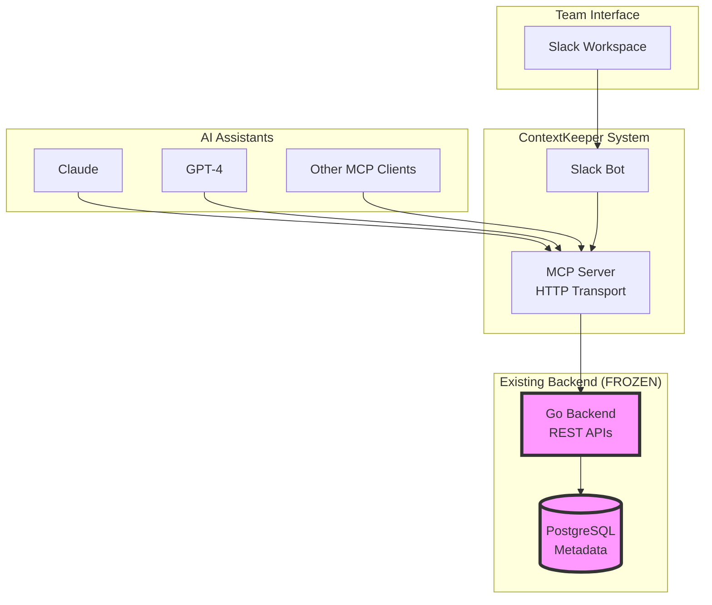

# Design Document: ContextKeeper MCP + Slack Bot

## Overview

The ContextKeeper MCP + Slack Bot system provides AI-powered repository context and team onboarding through a two-component architecture: an MCP (Model Context Protocol) server that bridges an existing Go backend with AI assistants, and a Slack bot that provides a team interaction surface. The system is designed for hackathon demonstration with a focus on clean MVP functionality over completeness.

The architecture follows a clear separation of concerns:
- **MCP Server**: Acts as a protocol bridge between AI assistants and the existing Go backend
- **Slack Bot**: Provides user-friendly commands for team members to access AI-powered context
- **Go Backend**: Existing frozen system that provides repository metadata via REST APIs

The system transforms the manual process of hunting for repository context (taking hours) into instant AI-powered responses (taking seconds), specifically targeting team onboarding and async context recall use cases.

## Architecture



### Component Responsibilities

**MCP Server**:
- Implements MCP HTTP transport protocol
- Exposes repository resources (metadata, context, timeline)
- Provides tools for context queries and onboarding summaries
- Translates MCP requests to Go backend REST API calls
- Handles protocol compliance and error translation

**Slack Bot**:
- Implements Slack slash commands (/context, /onboard, /recent, /status)
- Formats AI responses for Slack display
- Handles Slack API interactions and authentication
- Provides user-friendly error messages and help text
- Manages command routing and parameter validation

**Integration Points**:
- MCP Server ↔ Go Backend: HTTP REST API calls
- Slack Bot ↔ MCP Server: HTTP MCP protocol requests
- AI Assistants ↔ MCP Server: MCP HTTP transport
- Team Members ↔ Slack Bot: Slack slash commands

## Components and Interfaces

### MCP Server Component

**Core Interface**:
```typescript
interface MCPServer {
  start(port: number): Promise<void>
  stop(): Promise<void>
  handleRequest(request: MCPRequest): Promise<MCPResponse>
}

interface MCPRequest {
  method: string
  params: Record<string, any>
}

interface MCPResponse {
  result?: any
  error?: MCPError
}
```

**Resource Providers**:
```typescript
interface ResourceProvider {
  listResources(): Promise<Resource[]>
  getResource(uri: string): Promise<ResourceContent>
}

interface Resource {
  uri: string
  name: string
  description: string
  mimeType: string
}
```

**Tool Implementations**:
```typescript
interface ToolProvider {
  listTools(): Promise<Tool[]>
  callTool(name: string, arguments: Record<string, any>): Promise<ToolResult>
}

interface Tool {
  name: string
  description: string
  inputSchema: JSONSchema
}
```

### Slack Bot Component

**Command Handler Interface**:
```typescript
interface SlackBot {
  start(): Promise<void>
  stop(): Promise<void>
  handleCommand(command: SlackCommand): Promise<SlackResponse>
}

interface SlackCommand {
  command: string
  text: string
  userId: string
  channelId: string
}

interface SlackResponse {
  text: string
  blocks?: SlackBlock[]
  responseType: 'ephemeral' | 'in_channel'
}
```

**MCP Client Interface**:
```typescript
interface MCPClient {
  queryContext(query: string, repositoryId?: string): Promise<string>
  getOnboardingSummary(repositoryId: string): Promise<string>
  getRecentActivity(repositoryId: string, days?: number): Promise<string>
  getSystemStatus(): Promise<SystemStatus>
}
```

### Go Backend Integration

**REST API Client**:
```typescript
interface GoBackendClient {
  ingestRepository(repoUrl: string): Promise<IngestResponse>
  getRepositoryStatus(repoId: string): Promise<RepositoryStatus>
  queryContext(query: string, repoId?: string): Promise<ContextResponse>
}

interface ContextResponse {
  results: ContextItem[]
  metadata: {
    repositoryId: string
    queryTime: number
    resultCount: number
  }
}

interface ContextItem {
  type: 'pr' | 'issue' | 'commit'
  title: string
  body: string
  labels: string[]
  filesChanged?: string[]
  timestamp: string
  author: string
  url: string
}
```

## Data Models

### MCP Protocol Models

**MCP Resources**:
```typescript
interface RepositoryResource {
  uri: string // "contextkeeper://repository/{id}"
  name: string // Repository name
  description: string // Repository description
  mimeType: "application/json"
  content: RepositoryMetadata
}

interface ContextResource {
  uri: string // "contextkeeper://context/{id}"
  name: string // "Repository Context"
  description: string // Context description
  mimeType: "text/plain"
  content: string // Formatted context text
}

interface TimelineResource {
  uri: string // "contextkeeper://timeline/{id}"
  name: string // "Repository Timeline"
  description: string // Timeline description
  mimeType: "application/json"
  content: TimelineEvent[]
}
```

**MCP Tools**:
```typescript
interface QueryRepositoryContextTool {
  name: "query_repository_context"
  description: "Query repository for specific context information"
  inputSchema: {
    type: "object"
    properties: {
      query: { type: "string", description: "Natural language query" }
      repositoryId: { type: "string", description: "Optional repository ID" }
      limit: { type: "number", description: "Maximum results", default: 10 }
    }
    required: ["query"]
  }
}

interface GetOnboardingSummaryTool {
  name: "get_onboarding_summary"
  description: "Generate onboarding summary for new team members"
  inputSchema: {
    type: "object"
    properties: {
      repositoryId: { type: "string", description: "Repository ID" }
      focusAreas: { 
        type: "array", 
        items: { type: "string" },
        description: "Optional focus areas for onboarding"
      }
    }
    required: ["repositoryId"]
  }
}
```

### Slack Bot Models

**Command Models**:
```typescript
interface ContextCommand {
  command: "/context"
  parameters: {
    query: string
    repository?: string
  }
}

interface OnboardCommand {
  command: "/onboard"
  parameters: {
    repository?: string
    focus?: string[]
  }
}

interface RecentCommand {
  command: "/recent"
  parameters: {
    repository?: string
    days?: number
  }
}

interface StatusCommand {
  command: "/status"
  parameters: {}
}
```

**Response Models**:
```typescript
interface SlackContextResponse {
  text: string
  blocks: [
    {
      type: "section"
      text: {
        type: "mrkdwn"
        text: string // Formatted context response
      }
    },
    {
      type: "context"
      elements: [
        {
          type: "mrkdwn"
          text: string // Metadata (repository, query time, etc.)
        }
      ]
    }
  ]
  responseType: "ephemeral"
}
```

### Repository Data Models

**Repository Metadata** (from Go Backend):
```typescript
interface RepositoryMetadata {
  id: string
  name: string
  fullName: string
  description: string
  url: string
  defaultBranch: string
  language: string
  topics: string[]
  createdAt: string
  updatedAt: string
  lastIngestionAt: string
  status: "active" | "ingesting" | "error"
}

interface PullRequest {
  id: number
  title: string
  body: string
  state: "open" | "closed" | "merged"
  labels: Label[]
  filesChanged: string[]
  createdAt: string
  updatedAt: string
  author: string
  url: string
}

interface Issue {
  id: number
  title: string
  body: string
  state: "open" | "closed"
  labels: Label[]
  createdAt: string
  updatedAt: string
  author: string
  url: string
}

interface Commit {
  sha: string
  title: string
  body: string
  author: string
  timestamp: string
  filesChanged: string[]
  url: string
}

interface Label {
  name: string
  color: string
  description: string
}
```

### Configuration Models

**MCP Server Configuration**:
```typescript
interface MCPServerConfig {
  port: number
  goBackendUrl: string
  corsOrigins: string[]
  logLevel: "debug" | "info" | "warn" | "error"
  timeout: number // Request timeout in milliseconds
}
```

**Slack Bot Configuration**:
```typescript
interface SlackBotConfig {
  botToken: string
  signingSecret: string
  mcpServerUrl: string
  port: number
  defaultRepository?: string
  maxResponseLength: number
  retryAttempts: number
  retryDelay: number
}
```

**System Configuration**:
```typescript
interface SystemConfig {
  mcp: MCPServerConfig
  slack: SlackBotConfig
  demo: {
    sampleRepositoryId: string
    predictableResponses: boolean
    demoMode: boolean
  }
}
```

## Correctness Properties

*A property is a characteristic or behavior that should hold true across all valid executions of a system—essentially, a formal statement about what the system should do. Properties serve as the bridge between human-readable specifications and machine-verifiable correctness guarantees.*

### Property 1: MCP Server Port Binding
*For any* valid port configuration, starting the MCP server should result in the server successfully listening on that port and accepting connections.
**Validates: Requirements 1.1**

### Property 2: MCP Resource Response Completeness
*For any* valid repository resource request, the MCP server should return responses containing all required metadata fields (repository info, context data, and timeline information).
**Validates: Requirements 1.2**

### Property 3: Go Backend API Integration
*For any* valid context query, the MCP server should make the correct REST API calls to the Go backend and return properly formatted responses.
**Validates: Requirements 1.3**

### Property 4: MCP Tool Implementation
*For any* valid tool request (query_repository_context or get_onboarding_summary), the MCP server should execute the tool and return results in the correct format.
**Validates: Requirements 1.4, 1.5**

### Property 5: Slack Command Processing
*For any* valid Slack command (/context, /onboard, /recent, /status), the Slack bot should query the MCP server and return appropriately formatted responses.
**Validates: Requirements 2.1, 2.2, 2.3, 2.4**

### Property 6: Error Message Formatting
*For any* error condition (backend unavailable, MCP errors, invalid inputs), the system should return user-friendly error messages appropriate for the interface (Slack or MCP).
**Validates: Requirements 1.6, 2.5, 7.1, 7.4**

### Property 7: Repository Metadata Completeness
*For any* repository metadata query, the system should return complete information including all required fields for PRs, issues, and commits (titles, bodies, labels, timestamps, file changes).
**Validates: Requirements 3.1, 3.2, 3.3**

### Property 8: Timeline Chronological Ordering
*For any* timeline request, the system should return repository activity sorted in chronological order from most recent to oldest.
**Validates: Requirements 3.4**

### Property 9: Onboarding Summary Content
*For any* valid repository, onboarding summaries should include repository purpose, recent changes, and contributor information when available.
**Validates: Requirements 4.1, 4.2, 4.3**

### Property 10: Configuration Validation
*For any* system configuration (MCP server or Slack bot), the system should validate all required parameters and provide clear error messages for missing or invalid values.
**Validates: Requirements 6.1, 6.2, 6.3, 6.4**

### Property 11: Graceful Restart Behavior
*For any* configuration change, the system should restart without losing existing data or connections.
**Validates: Requirements 6.6**

### Property 12: Retry Mechanism with Exponential Backoff
*For any* failed Slack API call, the Slack bot should retry with exponential backoff up to the configured maximum attempts.
**Validates: Requirements 7.2**

### Property 13: Timeout Handling
*For any* MCP query that exceeds the timeout threshold, the system should return timeout messages with suggested retry actions.
**Validates: Requirements 7.3**

### Property 14: Secure Logging
*For any* error or system event, logs should contain appropriate debugging information without exposing sensitive data (tokens, credentials, personal information).
**Validates: Requirements 7.5**

### Property 15: Partial Data Handling
*For any* query where only partial repository data is available, the system should return available information with clear warnings about missing data.
**Validates: Requirements 7.6**

### Property 16: MCP Protocol Compliance
*For any* MCP request, the server should respond according to the MCP HTTP transport protocol specification, including proper resource descriptors, tool schemas, and error handling.
**Validates: Requirements 8.1, 8.2, 8.3, 8.4, 8.5, 8.6**

### Property 17: Demo Mode Predictability
*For any* demo mode execution, the system should use consistent sample data and provide predictable responses for demonstration purposes.
**Validates: Requirements 5.3**

### Property 18: Demo Fallback Handling
*For any* demo component failure, the system should provide clear fallback options to continue the demonstration.
**Validates: Requirements 5.6**

## Error Handling

### Error Categories

**MCP Protocol Errors**:
- Malformed requests: Return standard MCP error responses with error codes
- Unsupported methods: Return method not found errors
- Invalid parameters: Return parameter validation errors
- Timeout errors: Return timeout responses with retry suggestions

**Go Backend Integration Errors**:
- Connection failures: Return service unavailable errors with retry guidance
- API errors: Translate backend error codes to user-friendly messages
- Data not found: Return clear messages about missing repositories or data
- Authentication errors: Return authorization failure messages

**Slack Bot Errors**:
- Invalid commands: Return help text with available commands
- Permission errors: Return clear permission requirement messages
- Rate limiting: Implement exponential backoff and inform users of delays
- Formatting errors: Gracefully handle response formatting failures

### Error Response Formats

**MCP Error Response**:
```json
{
  "error": {
    "code": -32603,
    "message": "Internal error",
    "data": {
      "type": "backend_unavailable",
      "details": "Go backend service is currently unavailable. Please try again in a few moments.",
      "retryAfter": 30
    }
  }
}
```

**Slack Error Response**:
```json
{
  "text": "⚠️ Unable to process your request",
  "blocks": [
    {
      "type": "section",
      "text": {
        "type": "mrkdwn",
        "text": "*Error:* The repository service is temporarily unavailable.\n\n*Suggestion:* Please try again in a few moments, or use `/status` to check system health."
      }
    }
  ],
  "response_type": "ephemeral"
}
```

### Resilience Patterns

**Circuit Breaker**: Implement circuit breaker pattern for Go backend calls to prevent cascade failures during backend outages.

**Retry Logic**: Use exponential backoff for transient failures with maximum retry limits to prevent infinite loops.

**Graceful Degradation**: When partial data is available, return what can be provided with clear indicators of missing information.

**Timeout Management**: Set appropriate timeouts for all external calls (Go backend, Slack API) with user-friendly timeout messages.

## Testing Strategy

### Dual Testing Approach

The system requires both unit testing and property-based testing for comprehensive coverage:

**Unit Tests**:
- Specific command examples and edge cases
- Integration points between components
- Error conditions and boundary cases
- Slack message formatting validation
- MCP protocol compliance examples

**Property-Based Tests**:
- Universal properties across all inputs
- Comprehensive input coverage through randomization
- Minimum 100 iterations per property test
- Each test tagged with feature and property reference

### Property-Based Testing Configuration

**Testing Library**: Use `fast-check` for TypeScript/JavaScript property-based testing

**Test Configuration**:
- Minimum 100 iterations per property test
- Custom generators for repository data, Slack commands, and MCP requests
- Shrinking enabled for minimal failing examples
- Timeout configuration for long-running properties

**Test Tagging Format**:
```typescript
// Feature: contextkeeper-mcp-slack-bot, Property 1: MCP Server Port Binding
test('MCP server binds to configured port', async () => {
  await fc.assert(fc.asyncProperty(
    fc.integer({min: 3000, max: 9999}),
    async (port) => {
      // Property test implementation
    }
  ), {numRuns: 100});
});
```

### Unit Testing Focus Areas

**MCP Server Unit Tests**:
- Protocol compliance with specific MCP request examples
- Tool execution with known inputs and expected outputs
- Resource listing and content retrieval
- Error handling for specific failure scenarios

**Slack Bot Unit Tests**:
- Command parsing and validation
- Response formatting for different content types
- Error message formatting and display
- Integration with MCP client

**Integration Tests**:
- End-to-end command flow from Slack to Go backend
- Demo mode functionality with sample data
- Configuration loading and validation
- System startup and shutdown procedures

### Testing Data Management

**Mock Data**: Create comprehensive mock datasets for repositories, PRs, issues, and commits that cover various scenarios.

**Demo Data**: Maintain consistent demo dataset that produces predictable results for demonstration purposes.

**Test Isolation**: Ensure tests don't interfere with each other through proper setup and teardown procedures.

**Performance Testing**: Include basic performance tests to ensure response times meet demo requirements (sub-second responses).