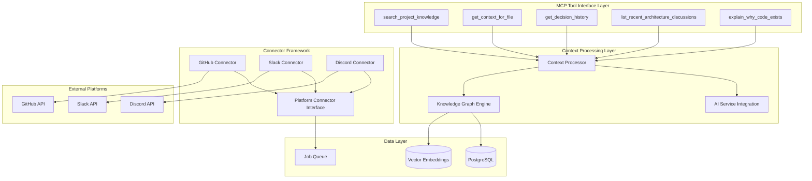

# Design Document: MCP Context Engine

## Overview

The MCP Context Engine transforms the existing Context Keeper system into a comprehensive, multi-platform developer context aggregation and retrieval system. The design extends the current Go-based architecture with a pluggable connector framework, intelligent context processing, and MCP-compatible tool interfaces.

The system maintains backward compatibility with existing GitHub functionality while adding support for Slack and Discord platforms. It introduces a knowledge graph layer for relationship tracking and provides MCP-standard tools for IDE integration.

## Architecture

The system follows a layered architecture with clear separation of concerns:



### Key Architectural Principles

1. **Backward Compatibility**: All existing APIs and data models remain unchanged
2. **Pluggable Connectors**: New platforms can be added without modifying core system
3. **Event-Driven Processing**: Asynchronous ingestion with background job processing
4. **Hybrid Storage**: PostgreSQL for structured data, vector embeddings for semantic search
5. **MCP Compliance**: Standard JSON-RPC 2.0 interface for tool integration

## Components and Interfaces

### Platform Connector Interface

The core abstraction for all platform integrations:

```go
type PlatformConnector interface {
    // Authenticate handles platform-specific OAuth flows
    Authenticate(ctx context.Context, config AuthConfig) (*AuthResult, error)
    
    // FetchEvents retrieves new events since last sync
    FetchEvents(ctx context.Context, since time.Time, limit int) ([]PlatformEvent, error)
    
    // NormalizeData converts platform events to common format
    NormalizeData(ctx context.Context, events []PlatformEvent) ([]NormalizedEvent, error)
    
    // ScheduleSync determines next sync interval based on platform limits
    ScheduleSync(ctx context.Context, lastSync time.Time) (time.Duration, error)
    
    // GetPlatformInfo returns connector metadata
    GetPlatformInfo() PlatformInfo
}

type PlatformEvent struct {
    ID          string                 `json:"id"`
    Type        EventType             `json:"type"`
    Timestamp   time.Time             `json:"timestamp"`
    Author      string                `json:"author"`
    Content     string                `json:"content"`
    Metadata    map[string]interface{} `json:"metadata"`
    References  []string              `json:"references"`
}

type NormalizedEvent struct {
    PlatformID   string                 `json:"platform_id"`
    EventType    EventType             `json:"event_type"`
    Timestamp    time.Time             `json:"timestamp"`
    Author       string                `json:"author"`
    Content      string                `json:"content"`
    ThreadID     *string               `json:"thread_id,omitempty"`
    ParentID     *string               `json:"parent_id,omitempty"`
    FileRefs     []string              `json:"file_refs"`
    FeatureRefs  []string              `json:"feature_refs"`
    Metadata     map[string]interface{} `json:"metadata"`
}
```

### GitHub Connector (Refactored)

Adapts existing GitHub service to the connector interface:

```go
type GitHubConnector struct {
    client     *GitHubService
    rateLimiter *RateLimiter
    config     *GitHubConfig
}

func (g *GitHubConnector) FetchEvents(ctx context.Context, since time.Time, limit int) ([]PlatformEvent, error) {
    // Leverage existing GitHub service methods
    prs, _ := g.client.GetPullRequests(ctx, token, owner, repo, 50)
    issues, _ := g.client.GetIssues(ctx, token, owner, repo, 50)
    commits, _ := g.client.GetCommits(ctx, token, owner, repo, 100)
    
    // Convert to PlatformEvent format
    return g.convertToEvents(prs, issues, commits), nil
}
```

### Slack Connector

New connector for Slack integration:

```go
type SlackConnector struct {
    client      *slack.Client
    rateLimiter *RateLimiter
    config      *SlackConfig
}

type SlackConfig struct {
    BotToken     string   `json:"bot_token"`
    Channels     []string `json:"channels"`
    IncludeDMs   bool     `json:"include_dms"`
    ThreadDepth  int      `json:"thread_depth"`
}

func (s *SlackConnector) FetchEvents(ctx context.Context, since time.Time, limit int) ([]PlatformEvent, error) {
    var events []PlatformEvent
    
    for _, channel := range s.config.Channels {
        messages, err := s.client.GetConversationHistory(&slack.GetConversationHistoryParameters{
            ChannelID: channel,
            Oldest:    fmt.Sprintf("%.6f", float64(since.Unix())),
            Limit:     limit,
        })
        if err != nil {
            return nil, fmt.Errorf("failed to fetch Slack messages: %w", err)
        }
        
        for _, msg := range messages.Messages {
            event := s.convertMessageToEvent(msg, channel)
            events = append(events, event)
            
            // Fetch thread replies if message has replies
            if msg.ReplyCount > 0 {
                replies, _ := s.fetchThreadReplies(channel, msg.Timestamp)
                events = append(events, replies...)
            }
        }
    }
    
    return events, nil
}
```

### Discord Connector

New connector for Discord integration:

```go
type DiscordConnector struct {
    session     *discordgo.Session
    rateLimiter *RateLimiter
    config      *DiscordConfig
}

type DiscordConfig struct {
    BotToken    string   `json:"bot_token"`
    GuildIDs    []string `json:"guild_ids"`
    ChannelIDs  []string `json:"channel_ids"`
    ThreadDepth int      `json:"thread_depth"`
}

func (d *DiscordConnector) FetchEvents(ctx context.Context, since time.Time, limit int) ([]PlatformEvent, error) {
    var events []PlatformEvent
    
    for _, channelID := range d.config.ChannelIDs {
        messages, err := d.session.ChannelMessages(channelID, limit, "", "", "")
        if err != nil {
            return nil, fmt.Errorf("failed to fetch Discord messages: %w", err)
        }
        
        for _, msg := range messages {
            if msg.Timestamp.After(since) {
                event := d.convertMessageToEvent(msg)
                events = append(events, event)
            }
        }
    }
    
    return events, nil
}
```

### Context Processing Engine

Transforms raw platform events into structured knowledge:

```go
type ContextProcessor struct {
    aiService    AIService
    knowledgeGraph *KnowledgeGraph
    embeddings   *EmbeddingService
}

type ProcessingResult struct {
    DecisionRecords    []DecisionRecord    `json:"decision_records"`
    DiscussionSummaries []DiscussionSummary `json:"discussion_summaries"`
    FeatureContexts    []FeatureContext    `json:"feature_contexts"`
    FileContexts       []FileContextHistory `json:"file_contexts"`
    Relationships      []Relationship      `json:"relationships"`
}

func (cp *ContextProcessor) ProcessEvents(ctx context.Context, events []NormalizedEvent) (*ProcessingResult, error) {
    result := &ProcessingResult{}
    
    // Group related events (threads, file references, etc.)
    eventGroups := cp.groupRelatedEvents(events)
    
    for _, group := range eventGroups {
        // Extract decisions from discussions
        decisions := cp.extractDecisions(ctx, group)
        result.DecisionRecords = append(result.DecisionRecords, decisions...)
        
        // Generate discussion summaries
        summaries := cp.generateSummaries(ctx, group)
        result.DiscussionSummaries = append(result.DiscussionSummaries, summaries...)
        
        // Build feature contexts
        features := cp.buildFeatureContexts(ctx, group)
        result.FeatureContexts = append(result.FeatureContexts, features...)
        
        // Track file contexts
        fileContexts := cp.buildFileContexts(ctx, group)
        result.FileContexts = append(result.FileContexts, fileContexts...)
        
        // Extract relationships
        relationships := cp.extractRelationships(ctx, group)
        result.Relationships = append(result.Relationships, relationships...)
    }
    
    return result, nil
}
```

### Knowledge Graph Layer

Extends the existing PostgreSQL schema with relationship tracking:

```sql
-- New tables for knowledge graph
CREATE TABLE knowledge_entities (
    id SERIAL PRIMARY KEY,
    type VARCHAR(50) NOT NULL, -- 'feature', 'file', 'decision', 'discussion', 'contributor'
    name VARCHAR(255) NOT NULL,
    description TEXT,
    metadata JSONB,
    embedding VECTOR(1536), -- For semantic search
    created_at TIMESTAMP DEFAULT NOW(),
    updated_at TIMESTAMP DEFAULT NOW()
);

CREATE TABLE knowledge_relationships (
    id SERIAL PRIMARY KEY,
    source_entity_id INTEGER REFERENCES knowledge_entities(id),
    target_entity_id INTEGER REFERENCES knowledge_entities(id),
    relationship_type VARCHAR(50) NOT NULL, -- 'relates_to', 'introduced_by', 'modified_by', 'discussed_in'
    strength FLOAT DEFAULT 1.0, -- Relationship strength for ranking
    metadata JSONB,
    created_at TIMESTAMP DEFAULT NOW()
);

CREATE TABLE decision_records (
    id SERIAL PRIMARY KEY,
    entity_id INTEGER REFERENCES knowledge_entities(id),
    title VARCHAR(255) NOT NULL,
    decision TEXT NOT NULL,
    rationale TEXT,
    alternatives TEXT[],
    consequences TEXT[],
    status VARCHAR(50) DEFAULT 'active', -- 'active', 'superseded', 'deprecated'
    platform_source VARCHAR(50) NOT NULL,
    source_event_ids TEXT[],
    created_at TIMESTAMP DEFAULT NOW()
);

CREATE TABLE discussion_summaries (
    id SERIAL PRIMARY KEY,
    entity_id INTEGER REFERENCES knowledge_entities(id),
    thread_id VARCHAR(255),
    platform VARCHAR(50) NOT NULL,
    participants TEXT[],
    summary TEXT NOT NULL,
    key_points TEXT[],
    action_items TEXT[],
    file_references TEXT[],
    feature_references TEXT[],
    created_at TIMESTAMP DEFAULT NOW()
);

CREATE TABLE file_context_history (
    id SERIAL PRIMARY KEY,
    entity_id INTEGER REFERENCES knowledge_entities(id),
    file_path VARCHAR(500) NOT NULL,
    change_reason TEXT,
    discussion_context TEXT,
    related_decisions INTEGER[] REFERENCES decision_records(id),
    contributors TEXT[],
    platform_sources JSONB, -- Track which platforms discussed this file
    created_at TIMESTAMP DEFAULT NOW()
);
```

### MCP Tool Interface

Implements the MCP specification for tool exposure:

```go
type MCPToolServer struct {
    contextService *ContextService
    knowledgeGraph *KnowledgeGraph
    authService    *AuthService
}

type MCPTool struct {
    Name        string      `json:"name"`
    Description string      `json:"description"`
    InputSchema interface{} `json:"inputSchema"`
}

func (m *MCPToolServer) ListTools(ctx context.Context) ([]MCPTool, error) {
    return []MCPTool{
        {
            Name:        "search_project_knowledge",
            Description: "Search across all project knowledge including discussions, decisions, and context",
            InputSchema: map[string]interface{}{
                "type": "object",
                "properties": map[string]interface{}{
                    "query": map[string]interface{}{
                        "type":        "string",
                        "description": "Search query for project knowledge",
                    },
                    "platforms": map[string]interface{}{
                        "type":        "array",
                        "items":       map[string]string{"type": "string"},
                        "description": "Filter by specific platforms (github, slack, discord)",
                    },
                    "limit": map[string]interface{}{
                        "type":        "integer",
                        "description": "Maximum number of results to return",
                        "default":     10,
                    },
                },
                "required": []string{"query"},
            },
        },
        {
            Name:        "get_context_for_file",
            Description: "Get comprehensive context for a specific file including change history and discussions",
            InputSchema: map[string]interface{}{
                "type": "object",
                "properties": map[string]interface{}{
                    "file_path": map[string]interface{}{
                        "type":        "string",
                        "description": "Path to the file relative to repository root",
                    },
                    "include_history": map[string]interface{}{
                        "type":        "boolean",
                        "description": "Include change history and related PRs",
                        "default":     true,
                    },
                },
                "required": []string{"file_path"},
            },
        },
        // Additional tools...
    }, nil
}

func (m *MCPToolServer) CallTool(ctx context.Context, name string, arguments map[string]interface{}) (*MCPToolResult, error) {
    switch name {
    case "search_project_knowledge":
        return m.searchProjectKnowledge(ctx, arguments)
    case "get_context_for_file":
        return m.getContextForFile(ctx, arguments)
    case "get_decision_history":
        return m.getDecisionHistory(ctx, arguments)
    case "list_recent_architecture_discussions":
        return m.listRecentArchitectureDiscussions(ctx, arguments)
    case "explain_why_code_exists":
        return m.explainWhyCodeExists(ctx, arguments)
    default:
        return nil, fmt.Errorf("unknown tool: %s", name)
    }
}
```

## Data Models

### Extended Models

The system extends existing models while preserving backward compatibility:

```go
// New knowledge graph models
type KnowledgeEntity struct {
    ID          int64                  `json:"id"`
    Type        EntityType            `json:"type"`
    Name        string                `json:"name"`
    Description string                `json:"description"`
    Metadata    map[string]interface{} `json:"metadata"`
    Embedding   []float32             `json:"-"` // Vector embedding for semantic search
    CreatedAt   time.Time             `json:"created_at"`
    UpdatedAt   time.Time             `json:"updated_at"`
}

type EntityType string

const (
    EntityTypeFeature     EntityType = "feature"
    EntityTypeFile        EntityType = "file"
    EntityTypeDecision    EntityType = "decision"
    EntityTypeDiscussion  EntityType = "discussion"
    EntityTypeContributor EntityType = "contributor"
)

type KnowledgeRelationship struct {
    ID               int64                  `json:"id"`
    SourceEntityID   int64                 `json:"source_entity_id"`
    TargetEntityID   int64                 `json:"target_entity_id"`
    RelationshipType RelationshipType      `json:"relationship_type"`
    Strength         float64               `json:"strength"`
    Metadata         map[string]interface{} `json:"metadata"`
    CreatedAt        time.Time             `json:"created_at"`
}

type RelationshipType string

const (
    RelationshipRelatesTo    RelationshipType = "relates_to"
    RelationshipIntroducedBy RelationshipType = "introduced_by"
    RelationshipModifiedBy   RelationshipType = "modified_by"
    RelationshipDiscussedIn  RelationshipType = "discussed_in"
)

type DecisionRecord struct {
    ID             int64     `json:"id"`
    EntityID       int64     `json:"entity_id"`
    Title          string    `json:"title"`
    Decision       string    `json:"decision"`
    Rationale      string    `json:"rationale"`
    Alternatives   []string  `json:"alternatives"`
    Consequences   []string  `json:"consequences"`
    Status         string    `json:"status"`
    PlatformSource string    `json:"platform_source"`
    SourceEventIDs []string  `json:"source_event_ids"`
    CreatedAt      time.Time `json:"created_at"`
}

type DiscussionSummary struct {
    ID                int64     `json:"id"`
    EntityID          int64     `json:"entity_id"`
    ThreadID          string    `json:"thread_id"`
    Platform          string    `json:"platform"`
    Participants      []string  `json:"participants"`
    Summary           string    `json:"summary"`
    KeyPoints         []string  `json:"key_points"`
    ActionItems       []string  `json:"action_items"`
    FileReferences    []string  `json:"file_references"`
    FeatureReferences []string  `json:"feature_references"`
    CreatedAt         time.Time `json:"created_at"`
}

type FileContextHistory struct {
    ID                int64                  `json:"id"`
    EntityID          int64                 `json:"entity_id"`
    FilePath          string                `json:"file_path"`
    ChangeReason      string                `json:"change_reason"`
    DiscussionContext string                `json:"discussion_context"`
    RelatedDecisions  []int64               `json:"related_decisions"`
    Contributors      []string              `json:"contributors"`
    PlatformSources   map[string]interface{} `json:"platform_sources"`
    CreatedAt         time.Time             `json:"created_at"`
}

// MCP Tool response models
type MCPToolResult struct {
    Content []MCPContent `json:"content"`
    IsError bool         `json:"isError,omitempty"`
}

type MCPContent struct {
    Type string      `json:"type"`
    Text string      `json:"text,omitempty"`
    Data interface{} `json:"data,omitempty"`
}
```

Now I need to use the prework tool to analyze the acceptance criteria before writing the correctness properties:

<function_calls>
<invoke name="prework">
<parameter name="featureName">mcp-context-engine
## Correctness Properties

*A property is a characteristic or behavior that should hold true across all valid executions of a system—essentially, a formal statement about what the system should do. Properties serve as the bridge between human-readable specifications and machine-verifiable correctness guarantees.*

Based on the prework analysis, the following properties have been identified after eliminating redundancy through property reflection:

### Property 1: Platform Connector Interface Compliance
*For any* platform connector implementation, all required interface methods (Authenticate, FetchEvents, NormalizeData, ScheduleSync) should be present and return the correct types
**Validates: Requirements 1.1, 2.6, 4.1**

### Property 2: Connector Isolation and Extensibility
*For any* combination of enabled platform connectors, adding or removing a connector should not affect the operation of other connectors
**Validates: Requirements 1.2, 9.3**

### Property 3: Incremental Synchronization Consistency
*For any* platform connector and timestamp, running incremental sync multiple times with the same timestamp should not create duplicate events
**Validates: Requirements 1.3, 3.6, 4.6**

### Property 4: Rate Limiting Compliance
*For any* platform connector encountering rate limits, the connector should implement exponential backoff and respect platform-specific rate limits
**Validates: Requirements 1.4, 3.5, 4.5**

### Property 5: Data Normalization Consistency
*For any* platform-specific event, the normalized output should conform to the common NormalizedEvent structure with all required fields populated
**Validates: Requirements 1.5, 3.7, 4.7**

### Property 6: OAuth Authentication Security
*For any* platform requiring OAuth authentication, token management should be secure and OAuth flows should complete successfully with appropriate scopes
**Validates: Requirements 1.6, 3.1, 4.1**

### Property 7: GitHub Backward Compatibility
*For any* existing GitHub API endpoint or authentication flow, the behavior should remain identical to the current system
**Validates: Requirements 2.1, 2.2, 2.5, 8.1, 8.2, 8.3, 8.5, 8.6**

### Property 8: GitHub Data Extraction Preservation
*For any* GitHub pull request, file-level change context should be extracted and JSONB serialization should work correctly for files_changed and labels fields
**Validates: Requirements 2.3, 2.4**

### Property 9: Thread Context Preservation
*For any* threaded conversation from Slack or Discord, parent-child relationships and thread context should be preserved in the normalized data
**Validates: Requirements 3.3, 4.3**

### Property 10: Cross-Platform Decision Extraction
*For any* discussion thread containing engineering decisions, the Context_Processor should extract Decision_Record objects regardless of the source platform
**Validates: Requirements 3.4, 4.4, 5.1**

### Property 11: Relationship Identification Accuracy
*For any* set of processed events, the Context_Processor should correctly identify relationships between files, features, and contributors
**Validates: Requirements 5.2, 5.3, 5.4**

### Property 12: Error Resilience in Processing
*For any* batch of events where some processing fails, the Context_Processor should log errors and continue processing remaining events
**Validates: Requirements 5.6**

### Property 13: Knowledge Graph Entity Storage
*For any* knowledge entity (Feature, File, Decision, Discussion, Contributor), the entity should be stored with proper relationships and support all specified relationship types
**Validates: Requirements 6.1, 6.2**

### Property 14: Vector Embedding Maintenance
*For any* knowledge object stored in the Knowledge_Graph, vector embeddings should be properly maintained for semantic search capabilities
**Validates: Requirements 6.3**

### Property 15: Schema Migration Data Preservation
*For any* existing data in the PostgreSQL database, schema extensions should preserve all current data while adding new capabilities
**Validates: Requirements 6.4, 8.4**

### Property 16: Graph Query Functionality
*For any* valid graph traversal query, the Knowledge_Graph should return correct relationship paths and maintain referential integrity
**Validates: Requirements 6.5, 6.6**

### Property 17: MCP Tool Implementation Completeness
*For any* required MCP tool (search_project_knowledge, get_context_for_file, get_decision_history, list_recent_architecture_discussions, explain_why_code_exists), the tool should be properly implemented and callable via JSON-RPC
**Validates: Requirements 7.1, 7.2, 7.3, 7.4, 7.5**

### Property 18: Response Size Management
*For any* tool response that exceeds token limits, the Tool_Interface should provide appropriately summarized responses or support streaming
**Validates: Requirements 7.6, 7.7**

### Property 19: Tool Authentication Enforcement
*For any* MCP tool call, authentication and authorization should be properly enforced
**Validates: Requirements 7.8**

### Property 20: Configuration-Driven Connector Management
*For any* platform connector configuration, the system should properly enable/disable connectors and skip ingestion pipelines for disabled connectors
**Validates: Requirements 9.1, 9.2**

### Property 21: Token Security and Encryption
*For any* platform authentication token, the token should be encrypted and securely stored with proper access controls
**Validates: Requirements 9.4**

### Property 22: Structured Logging Compliance
*For any* platform connector activity, structured logging should capture the activity with appropriate detail and error handling
**Validates: Requirements 9.6, 9.7**

### Property 23: Horizontal Scaling Support
*For any* ingestion pipeline with multiple worker instances, jobs should be processed correctly without conflicts or data corruption
**Validates: Requirements 10.1**

### Property 24: Performance Requirements Compliance
*For any* tool query on large repositories, response times should remain under one second, and caching should improve performance for repeated queries
**Validates: Requirements 10.2, 10.5**

### Property 25: Resource Management and Monitoring
*For any* system operation, database connection pooling should be implemented, performance metrics should be collected, and graceful degradation should occur under memory pressure
**Validates: Requirements 10.3, 10.6, 10.7**

## Error Handling

The system implements comprehensive error handling across all layers:

### Connector Layer Error Handling
- **Rate Limit Errors**: Exponential backoff with platform-specific retry strategies
- **Authentication Errors**: Clear error messages with re-authentication guidance
- **Network Errors**: Retry logic with circuit breaker patterns
- **Data Format Errors**: Graceful handling with detailed logging for debugging

### Processing Layer Error Handling
- **AI Service Failures**: Fallback to basic text processing with error logging
- **Batch Processing Errors**: Individual event failures don't stop batch processing
- **Memory Pressure**: Graceful degradation with reduced batch sizes
- **Database Errors**: Transaction rollback with retry mechanisms

### MCP Tool Layer Error Handling
- **Invalid Parameters**: JSON schema validation with descriptive error messages
- **Authorization Failures**: Clear authentication error responses
- **Query Timeouts**: Partial results with timeout indicators
- **Large Response Handling**: Automatic summarization or streaming responses

### Database Layer Error Handling
- **Connection Pool Exhaustion**: Queue management with timeout handling
- **Migration Failures**: Rollback mechanisms with data integrity checks
- **Constraint Violations**: Detailed error messages with resolution guidance
- **Performance Degradation**: Query optimization with fallback strategies

## Testing Strategy

The system employs a comprehensive dual testing approach combining unit tests and property-based tests:

### Property-Based Testing
Property-based tests validate universal correctness properties across all inputs using a minimum of 100 iterations per test. Each property test references its corresponding design document property using the tag format: **Feature: mcp-context-engine, Property {number}: {property_text}**.

**Key Property Test Areas:**
- Connector interface compliance and isolation
- Data normalization consistency across platforms
- Authentication and security boundary enforcement
- Knowledge graph relationship integrity
- MCP tool interface correctness
- Performance and scalability requirements

### Unit Testing
Unit tests focus on specific examples, edge cases, and integration points:

**Core Unit Test Coverage:**
- Platform connector authentication flows
- Data transformation and serialization
- Error handling and recovery mechanisms
- Database migration and schema changes
- MCP tool parameter validation
- Rate limiting and backoff strategies

### Integration Testing
Integration tests verify component interactions:
- End-to-end platform data ingestion flows
- Context processing pipeline validation
- Knowledge graph relationship building
- MCP tool integration with external systems
- Performance testing under load conditions

### Testing Configuration
- **Property Tests**: Minimum 100 iterations per test with randomized inputs
- **Unit Tests**: Comprehensive coverage of edge cases and error conditions
- **Integration Tests**: Full system workflow validation
- **Performance Tests**: Sub-second response time validation for tool queries
- **Security Tests**: Authentication, authorization, and data encryption validation

The testing strategy ensures both correctness through property validation and reliability through comprehensive unit and integration testing coverage.